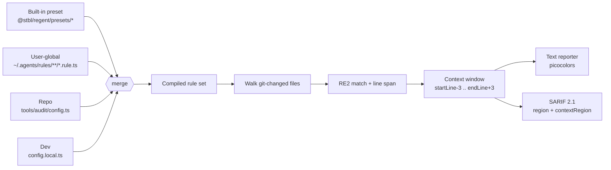

<p align="right">
  <picture>
    <source media="(prefers-color-scheme: dark)" srcset="assets/header-dark.svg">
    
  </picture>
</p>

<p align="right">
  <a href="https://github.com/dot-stbl/regent/actions/workflows/ci.yml"></a>
  <a href="https://github.com/dot-stbl/regent/blob/main/LICENSE"></a>
  <a href="https://github.com/dot-stbl/regent/tags"></a>
  <a href="https://github.com/dot-stbl/regent/issues"></a>
</p>

<p align="center">
  <strong>The enforcer of <code>[.stbl]</code> house rules.</strong>
  <br>
  Grep- and regex-based rule registry. TypeScript-native. Linear-time regex.
  <br><br>
  <a href="#install">Install</a> ·
  <a href="#in-action">In action</a> ·
  <a href="#how-it-works">How it works</a> ·
  <a href="#writing-a-rule">Writing a rule</a> ·
  <a href="CONTRIBUTING.md">Contributing</a> ·
  <a href="https://github.com/dot-stbl/brand">Brand kit</a>
</p>

---

## What it does

`regent` reads **rule files** alongside the prose that documents them,
runs them across your repository, and reports violations as styled text
(for terminals and agents) or **SARIF 2.1** (for CI / GitHub code
scanning).

Rules live as `*.rule.ts` files paired with sibling `*.md` prose — same
basename, same folder. Roslyn-style analyzer rules stay in
`.editorconfig`; `regent` covers what analyzers can't see —

- **Naming grep** (`ct`, `req`, `tmp` parameter names; forbidden suffixes)
- **Structural grep** (`private` methods, `throw ex;`, `_ =` discards)
- **File-glob conventions** (`#region`, single-line interfaces)
- **Project-shape invariants** that don't fit `[CA|RCS|VSTHRD]` (no
  `using` provider namespaces from module code)

A **regent** is the appointed ruler who enforces the law. The metaphor
holds: rules are codified prose, `regent` walks the codebase and
reports who's out of line.

## Install

```sh
bun add @stbl/regent
```

> Registry: `@stbl/regent` is published to **GitHub Packages** under
> the `.stbl` scope. Configure `~/.npmrc` with
> `@stbl:registry=https://npm.pkg.github.com` before installing. Bun
> resolves this automatically when the `.npmrc` lives in your project
> root.

## In action

```sh
$ bunx @stbl/regent check
src/Foo.cs:42 [error] csharp.no-private-methods
   39 │ public class Foo
   40 │ {
   41 │     private readonly ILogger _log;
   42 │     private void Bar() {                ← regent v0.1
   43 │         return;
   44 │     }
   45 │ }

  no private methods in production code — extract to file-static helper
  Source: ~/.agents/rules/csharp/code-shape.md#no-private-business-logic

src/Foo.cs:60 [error] csharp.no-region-directive
   60 │ #region Properties

  #region запрещён в C# (code-shape.md §10)
  Source: ~/.agents/rules/csharp/code-shape.md#no-region-directives

─────────── Review candidates ───────────

src/Baz.cs:42 [review] csharp.no-todo-without-owner
   40 │ public void Foo() {
   41 │     // TODO follow-up
   42 │     DoThing();

  ⓘ проверь что у TODO есть owner или ticket (например `TODO(ANL-200):`).
       Если нет — добавь ticket или `regent accept` с причиной.
  Source: code-shape.md#todo-without-owner

2 errors · 1 review · 50 rules
```

For CI:

```sh
$ bunx @stbl/regent check --format sarif --out audit.sarif
$ bunx @stbl/regent check --no-review    # CI variant — review section hidden
```

`regent review` produces the LLM-friendly list:

```sh
$ bunx @stbl/regent review > candidates.md
# regent review candidates
> Read each finding, decide accept|reject ...
## `src/Baz.cs:42`
- **Rule:** `csharp.no-todo-without-owner`
- **Guidance:** проверь что у TODO есть owner или ticket ...
```

SARIF integrates with **GitHub code scanning** via
`github/codeql-action/upload-sarif@v3` — review findings show up as
`note` (not `warning`), so they don't fail required checks but are
visible in the diff view.

## Quickstart

```sh
# In a repo with @stbl/regent installed
bunx @stbl/regent check [--all]            # violations + review (default)
bunx @stbl/regent check --no-review        # violations only (CI variant)
bunx @stbl/regent review [--format json]   # pending review findings (markdown or json)
bunx @stbl/regent list                     # every loaded rule + origin
bunx @stbl/regent explain csharp.no-private-methods
bunx @stbl/regent init                     # scaffold tools/audit/

# Tri-state review: accept|reject|ignore findings persistently
bunx @stbl/regent accept csharp.no-todo-without-owner \
    src/Baz.cs:42 --reason "tracked in ANL-200"
bunx @stbl/regent reject csharp.no-todo-without-owner \
    src/Baz.cs:60
```

The `accept`/`reject` commands mutate `tools/audit/config.local.ts`
(Layer 4 — gitignored per dev) or `config.ts` (Layer 3 — committed)
so decisions persist across runs and survive code review.

## How it works

`regent` merges rules from four layers. **Top wins.**



| Priority | Source | Discovery |
|---|---|---|
| 1 (base) | Built-in presets | `@stbl/regent/presets/*` (loaded by default) |
| 2 | User-global | `~/.agents/rules/**/*.rule.ts` (auto-loaded, recursive) |
| 3 | Repository | `<repo>/tools/audit/{config.ts, rules/*.rule.ts}` (committed) |
| 4 (top) | Per-developer | `<repo>/tools/audit/config.local.ts` (gitignored) |

Each rule is a `.rule.ts` file paired with a `.md` document of the
same basename in the same folder. The `.md` is the human-readable
rationale; the `.rule.ts` is the executable form. The loader
auto-derives the `source` field (a back-link to the prose) when not
set explicitly.

The match step uses **RE2** via `re2-wasm` — linear-time matching,
no ReDoS surface. Patterns use RE2 syntax (no backreferences, no
lookahead) which prevents catastrophic backtracking on adversarial
input.

The context window is hardcoded to **3 lines before and 3 after** the
match (`src/constants.ts`). Single-line matches produce 7 lines of
context; multi-line matches naturally extend because the
`endLine + 3` is computed from the match's end.

## Tri-state review

Some matches aren't always violations. `regent` handles them with
three explicit states per finding:

| State | Triggered by | Visible in `regent check`? | Visible in `regent review`? | Exit code? |
|---|---|---|---|---|
| `pending` | review-rule match, not in accept-list | yes, "Review candidates" section (default) | yes, primary content | only when `review.exitBehavior === 'unreviewed-fails'` + severity threshold |
| `accepted` | matched accept-list entry for `(ruleId, path[, line])` | no (filtered) | only with `--include-accepted` (audit) | never |
| `violation` | non-review rule OR unreviewed review-rule | yes, top section | no (review-only shows pending) | when severity ≥ `--exit-on` |

### How to author a review-mode rule

```ts
// ~/.agents/rules/csharp/no-todo-without-owner.rule.ts
import { defineRule } from '@stbl/regent';

export default defineRule({
  id: 'csharp.no-todo-without-owner',
  severity: 'warning',
  pattern: '//\\s*(TODO|FIXME)\\b',
  excludeWhen: '//\\s*(TODO|FIXME)\\s*\\(',     // skip if has ticket ref
  globs: ['**/*.cs'],
  message: 'TODO / FIXME без owner / ticket ref',
  source: 'code-shape.md#todo-without-owner',
  review: {
    enabled: true,
    exitBehavior: 'unreviewed-fails',         // fail CI unless accepted
    guidance: 'проверь что у TODO есть owner или ticket ...',
  },
});
```

`exitBehavior` choices:

- `'no-fail'` (default) — review findings never affect exit code. The
  rule's `severity` still drives reporter color.
- `'unreviewed-fails'` — any unreviewed pending finding fails CI at
  `severity >= --exit-on`. Acceptance via `regent accept` clears the
  failure.

### How tri-state compares to alternatives

| Concern | Strict | Review (this) | Disable |
|---|---|---|---|
| Output | violations section | review section | hidden entirely |
| Future runs | re-fires forever | re-fires until accepted | silenced forever |
| CI exit code | fails | depends on `exitBehavior` | never |
| Agent-readable source | finding message + rationale | finding message + `guidance` + provenance | n/a |
| Recovery | edit code | `regent accept ... --reason "..."` | edit `disable` in config |

`regent accept` is the missing 3rd state: **"yes, this match is
intentional under these documented terms."** The reason is required
(500 chars max) for audit-trail and is propagated to the finding's
`acceptedReason` field which surfaces via SARIF
`properties.reason` and the audit view of `regent review
--include-accepted`.

## Writing a rule

```ts
// ~/.agents/rules/csharp/no-region-directive.rule.ts
import { defineRule } from '@stbl/regent';

export default defineRule({
  id: 'csharp.no-region-directive',
  severity: 'error',                  // error | warning | suggestion
  pattern: '^\\s*#region\\b',         // RE2 syntax — no backreferences
  globs: ['**/*.cs'],
  excludePaths: ['**/*.g.cs', '**/obj/**'],
  message: '#region запрещён в C# (code-shape.md §10)',
  // source auto-derived from sibling no-region-directive.md
});
```

Pair it with `no-region-directive.md` documenting the rationale. The
prose + executable then propagate via `regent explain <id>` and into
each finding's output.

Per-project override:

```ts
// tools/audit/config.ts (committed)
import { defineConfig } from '@stbl/regent';

export default defineConfig({
  extends: ['@stbl/regent/presets/csharp', '~/.agents/rules/csharp/*.rule.ts'],
  rules: {
    disable: ['csharp.no-public-fields'],
    override: { 'csharp.no-private-methods': { severity: 'warning' } },
    add: [],
  },
});
```

`config.local.ts` (gitignored) layers on top — each developer can
mute rules locally without committing changes.

## When to use `regent`, not `.editorconfig` / ESLint / Roslyn

| Concern | `.editorconfig` + analyzers | ESLint | **`regent`** |
|---|---|---|---|
| Compile-time invariants | ✅ | partial | ❌ (separate) |
| Cross-file grep rules | ❌ | via plugins | ✅ (built-in) |
| Inline alongside `.md` prose | ❌ | ❌ | ✅ |
| Lives outside the repo (user-global) | ❌ | ❌ | ✅ (`~/.agents/rules/`) |
| Per-dev override without commit | ❌ | partial | ✅ (`config.local.ts`) |
| SARIF for CI / IDE | via csproj | via plugins | ✅ (built-in) |
| Linear-time ReDoS-safe regex | n/a | n/a | ✅ (RE2) |

`regent` is the grep/regex layer **alongside** analyzer-style tools,
not their replacement. Use `.editorconfig` for project-wide build
flags, ESLint for `.ts`/`.tsx` (and `biome check` for fast Rust-native
lint), and `regent` for rules that should travel with the prose that
explains them.

## Status

|   |   |
|---|---|
| Stage | Pre-release (skeleton + 2 csharp rules) |
| Version | 0.1.0 (not yet tagged) |
| License | MIT |
| Runtime | Bun ≥ 1.1 (Node 20+ also supported) |
| Regex | `re2-wasm` (linear-time, no ReDoS) |
| Test runner | vitest |
| CI | GitHub Actions (OIDC publish to GitHub Packages) |

## Architecture

| File | Role |
|---|---|
| `src/types.ts` | `RuleSpec`, `Severity`, `Config`, `Finding`, `ContextWindow` |
| `src/define-rule.ts` | `defineRule<T>()`, `defineConfig<T>()` — type-safe narrowing + freeze |
| `src/constants.ts` | `DEFAULT_CONTEXT_BUFFER = 3` |
| `src/regex.ts` | `compileRegex`, `scanFirst`, `extractContext` over `re2-wasm` |
| `src/loader.ts` | 4-layer merge, sibling `.md` back-link, config extends/glob |
| `src/runner.ts` | line-by-line RE2 scan, byte-offset context extraction |
| `src/reporter/text.ts` | picocolors, multi-line context, severity-coloured gutter |
| `src/reporter/sarif.ts` | SARIF 2.1 `region` + `contextRegion` for GitHub code scanning |
| `src/cli.ts` | commander: `regent <check\|list\|init\|explain>` |
| `src/presets/csharp.ts` | `noRegion`, `noPrivateMethods` |

## Related

- [`.stbl` brand kit](https://github.com/dot-stbl/brand) — design
  rules, asset templates, contributing notes (TRADEMARK restraint,
  mark hierarchy, lockup pattern)
- [`.stbl` org](https://github.com/dot-stbl) — sibling projects
  (`tessera`, `plexor`, `anlytra`, …)
- [`.stbl/regent` repo](https://github.com/dot-stbl/regent) — issues,
  PRs, releases

---

<sub><code>regent</code> is built by <a href="https://github.com/dot-stbl">.stbl</a>. — <code>[.stbl](feat/regent): init scaffolding</code></sub>
