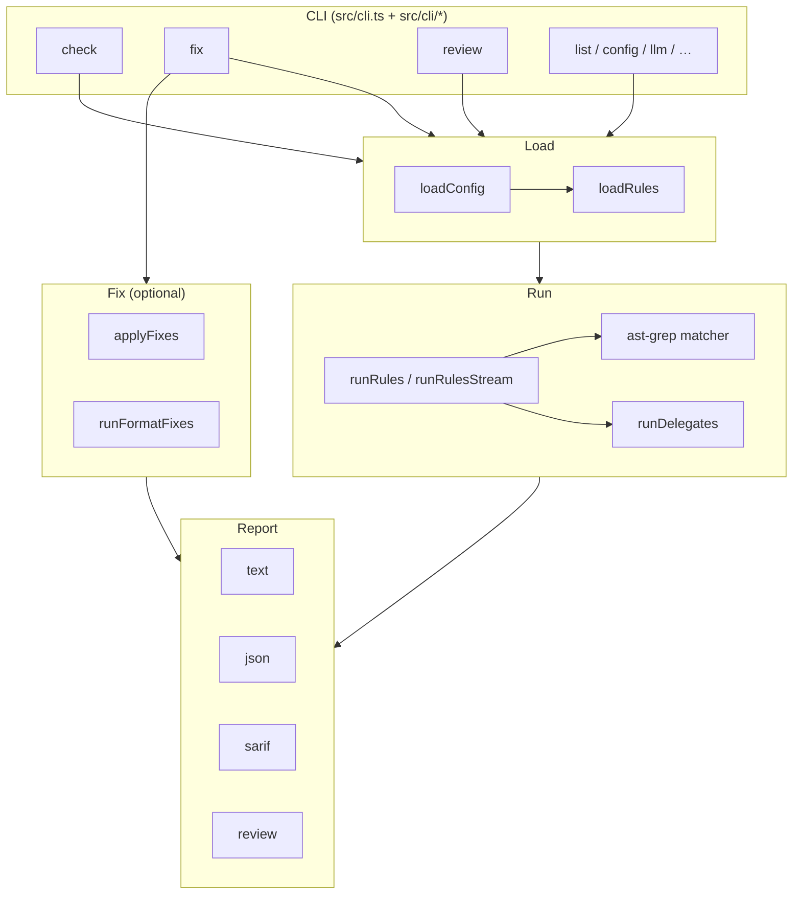

# Architecture

regent (`@dot-stbl/regent`) is a **multi-mode static analysis framework** aimed at LLM agents and human maintainers. It loads project-authored rules, scans a file scope (regex and/or AST), optionally applies fixes, and reports findings (text / JSON / SARIF / review).

It ships **zero product rules**. Language support means **parsers** (ast-grep packs), not a curated lint catalog. Rules live in the consuming repo, user-global paths, plugins (`extends`), or are copied from `examples/`.

## System overview



## Pipeline: load → detect/AST → fix → report

| Stage | What happens | Primary modules |
|-------|----------------|-----------------|
| **Config** | Merge layers (defaults → global → project → local → env → CLI args). Strict Zod schema. | `src/config/*` |
| **Load rules** | Discover files + inline config + `extends` plugins; materialize parameterized rules; resolve accept-list. | `src/loader.ts`, `src/loader/*` |
| **Scope** | Collect files: git-changed (default) or `--all`; apply exclude globs / `@group` refs; cap file size. | `src/runner.ts` (`collectFiles`) |
| **Detect (regex)** | Per-file RE2 match; optional `excludeWhen`; context window; accept-list / tri-state status. | `src/regex.ts`, `src/runner.ts` |
| **Detect (AST)** | Parse via language bundle + ast-grep rule; same finding model. | `src/ast/matcher.ts`, `src/kinds/ast.ts`, `src/bundles/` |
| **Delegate** | Shell out read-only tools (`defineDelegate`); merge findings. | `src/runner/delegate.ts`, `src/kinds/delegate.ts` |
| **Fix** | `applyFixes` on findings with `fix` attachments; optional format-tool mutations. | `src/fixer.ts`, `src/cli/fix.ts` |
| **Report** | text / JSON / SARIF / review markdown; exit code from severity + review policy. | `src/reporter/*` |

### Fix path (detail)

1. Run detect (regex rules with fix attachments; format specs separately).
2. `applyFixes` lanes: **safe** by default; **all** with `--unsafe` (function-form + `safety: 'suggested'`).
3. Optional fixpoint for rules with `converges: true` (`--max-passes`, default 5, cap 20).
4. `guidance-only` fixes are never auto-applied.
5. Transform rules are **loaded/validated** today; full runner invocation of `transform()` is still follow-up work (see comments in `src/kinds/transform.ts`).

## Rule kinds

| Kind | Factory | Typical files | Role |
|------|---------|---------------|------|
| **Detect (regex)** | `defineDetectRule` | `*.lint.ts` / `*.rule.ts` | Pattern → finding. RE2 (no backrefs / lookbehind); use `excludeWhen` for false positives. |
| **Detect (AST)** | `defineAstRule` | AST rule modules / `rules.ast[]` | ast-grep matcher over language bundles — preferred when structure matters. |
| **Fix attachment** | On detect/fix specs via `RuleFixSpec` | same rule + `fix: { kind, … }` | `replace` \| `delete-line` \| `function` \| `guidance-only`; `safety: 'safe' \| 'suggested'`. |
| **Fix rule** | `defineFixRule` | `*.fix.ts` / `rules.fix[]` | Match + rewrite oriented rule shape (loader/config). |
| **Transform** | `defineTransformRule` | `*.transform.ts` / `rules.transform[]` | Whole-file pure `transform(path, content) → string`. Loaded; pipeline invoke incomplete. |
| **Format** | `defineFormat` | `*.format.ts` / `rules.format[]` | Shell out to **mutating** tools (`dotnet format`, prettier, …). check = detect argv; fix = fix argv. |
| **Delegate** | `defineDelegate` | `*.delegate.ts` / `rules.delegate[]` | Shell out to **read-only** tools (eslint, ruff, tsc). No `fix` field. |
| **Parameterized** | `defineParameterizedRule` | any of the above with `params` | Zod `params` + function-typed fields; values from `rules.configure`. |

Also: legacy `defineRule` remains exported; prefer kind-specific factories.

### Discovery roots (rules)

From `src/loader.ts` (simplified order; later wins on id collision where documented):

1. User-global: `~/.agents/rules/**` (override via `STBL_REGENT_GLOBAL_RULES_PATH`) — `*.lint.ts`, `*.format.ts`, `*.delegate.ts`, …
2. Project: `tools/audit/rules/**` (and format/delegate under `tools/audit/`)
3. Inline: `rules.detect[]`, `fix[]`, `ast[]`, `transform[]`, `format[]`, `delegate[]`
4. `rules.extends[]` — paths, globs, or npm packages (`@scope/regent-…`)
5. Filters: `disable`, `override`, `configure`, `accept`

Sibling `.md` prose is auto-linked for SARIF `helpUri` / `regent explain` when present.

## Key modules

| Path | Responsibility |
|------|----------------|
| `src/cli.ts` | Commander entry: most subcommands, check/review/list/init/accept/reject/cache/example/benchmark/llm |
| `src/cli/fix.ts` | `regent fix` |
| `src/cli/describe.ts` | Parameterized-rule JSON Schema introspection |
| `src/cli/diff.ts` | Finding delta vs cached/JSON baseline |
| `src/cli/update.ts` | npm registry version check + `regent update` |
| `src/cli/annotate-pr.ts` | Optional PR review comments via `gh api` (`check --annotate-pr`) |
| `src/cli/banner.ts`, `startup-progress.ts`, `module-type-check.ts` | UX / ESM hints |
| `src/config/*` | Schema, merge, layers, exclude groups, inspect |
| `src/loader.ts` + `loader/*` | Rule discovery, plugins, parameterize, format/delegate files |
| `src/runner.ts` | File scope, concurrency pool, regex + AST scan, accept-list, stream API |
| `src/runner/delegate.ts` | Safe spawn for format/delegate specs |
| `src/fixer.ts` | Deterministic edit application + fixpoint |
| `src/transformer.ts` | Transform helpers (support for transform kind) |
| `src/kinds/*` | Rule factories and kind types |
| `src/ast/matcher.ts` | ast-grep parse/match |
| `src/bundles/index.ts` | Language packs + project version detection |
| `src/regex.ts` | RE2 compile + match helpers |
| `src/patterns/index.ts` | Shared regex builders for examples/authors |
| `src/core/cache.ts` | Disk cache `.regent/cache.json` |
| `src/core/scanner*.ts`, `dag.ts`, `diff.ts`, `benchmark.ts` | Core utilities |
| `src/reporter/*` | text, json, sarif, review, fix JSON schema |
| `src/llm.ts`, `llm-router.ts`, `llm-schema.ts` | `regent llm` asset routing + JSON schemas |
| `src/examples/index.ts` | Shipped example list/copy |
| `src/watcher.ts` | chokidar debounce for `check --watch` |
| `src/types.ts` | Shared types (`Finding`, `RuleFixSpec`, …) |
| `src/index.ts` | Public library export surface |
| `assets/llm/**` | Agent-facing markdown + schemas |
| `examples/<lang>/**` | Curated example rules + fixtures |

## Cache

- **Path:** `.regent/cache.json` (`defaultCachePath`).
- **Key:** content hash + rule-spec hash + kind (`detect` \| `fix`); optional `ruleId` for reverse invalidation.
- **Header:** `schemaVersion` + `runnerVersion` — mismatch invalidates entire store.
- **Policy:** LRU by `cache.maxBytes` (default 100 MiB); TTL `cache.maxAge` (default 7 days).
- **CLI:** `regent cache stats` \| `regent cache clear`.
- Watch mode invalidates by file hash between re-runs.

## Concurrency

- Default **4** in-flight file scans (`runner.concurrency`).
- Override: config, `STBL_REGENT_RUNNER_CONCURRENCY`, or `check --concurrency <n>`.
- Clamped to ≥ 1. Matches typical libuv threadpool sizing for mixed I/O + CPU work.

## Exclude groups

Named globs referenced as `@name` in `excludePaths` (rule or project):

| Builtin | Example globs |
|---------|----------------|
| `@generated` | `**/*.g.cs`, `**/Generated/**`, `**/__generated__/**` |
| `@migrations` | `**/Migrations/**`, `**/*Migration.cs` |
| `@build-output` | `**/bin/**`, `**/obj/**`, `**/dist/**`, … |
| `@node-modules` | `**/node_modules/**` |
| `@git` | `**/.git/**` |
| `@ide` | `**/.vscode/**`, `**/.idea/**` |
| `@vendored` | `**/vendor/**`, `**/third_party/**` |

User groups: `excludeGroups` in config (kebab-case names). User overrides builtin on name conflict (with warning).

Hard-coded runner excludes always include `node_modules`, `dist`, `bin`, `obj`, `.git` for the default check scope.

## Config layering

Precedence **low → high** (`src/config/index.ts`):

1. **defaults** — schema defaults  
2. **global** — `~/.config/regent/config.*`  
3. **project** — `.regentrc.*` (walk-up) and/or legacy `tools/audit/config.ts`  
4. **local** — `.regentrc.local.*` / `config.local.ts` (gitignored, per-dev)  
5. **env** — `STBL_REGENT_*` (plus dotenv load)  
6. **args** — commander options  

Inspect with:

```sh
regent config layers
regent config show cache.enabled
regent config diff
```

Strict mode: unknown keys fail load. Top-level knobs include `rules`, `excludePaths`, `excludeGroups`, `cache`, `log`, `output`, `runner`.

### Logging streams

- **stdout:** findings / machine reports  
- **stderr:** pino ops logs + hints (update check, autodetect)  
- Level/format: `STBL_REGENT_LOG_*` then `--log-level` / `--log-format`

## Tri-state findings

| Status | Meaning |
|--------|---------|
| `violation` | Normal fail candidate (subject to `--exit-on`) |
| `pending` | `review.enabled` rule; optional `exitBehavior: 'unreviewed-fails'` |
| `accepted` | Matched accept-list entry; never fails |

`regent accept` / `regent reject` manage silence vs escalate for review workflow.

## Language bundles

`regent bundles` lists parse setups (not rule packs): C# / TypeScript / Go / Rust packs via `@ast-grep/lang-*`, default globs, grammar notes, and project version probes (csproj, tsconfig, go.mod, Cargo.toml, …).

## Deliberately out of scope

| Not regent’s job | Prefer instead |
|------------------|----------------|
| Bundled “product” lint catalog | Project rules, plugins, `examples/` copies |
| Full-project formatter | prettier / biome / `dotnet format` via **format** specs or native tools |
| Replacing ESLint/Biome rule libraries | Layer: native tool for stock rules, regent for house rules agents can author |
| Long-lived format/watch inside delegated tools | Runner blocklist refuses watch/serve-style argv |
| Inventing architecture per project | Agents author **rules**; regent is the engine |

See also [migrating/README.md](./migrating/README.md).

## Library surface

Programmatic use (same engine as CLI) via `@dot-stbl/regent`:

- `defineDetectRule` / `defineAstRule` / `defineFixRule` / `defineTransformRule` / `defineFormat` / `defineDelegate` / `defineConfig`
- `loadRules`, `runRules`, `runRulesStream`
- `applyFixes`
- reporters + types (`Finding`, `RuleFixSpec`, …)

See `src/index.ts` for the authoritative export list.
